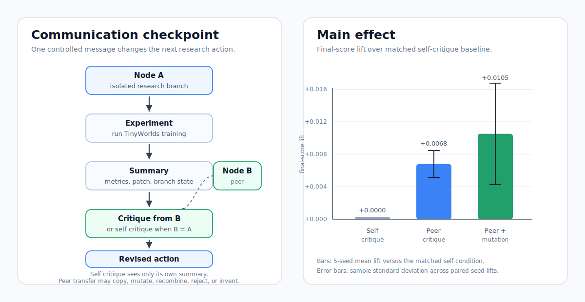
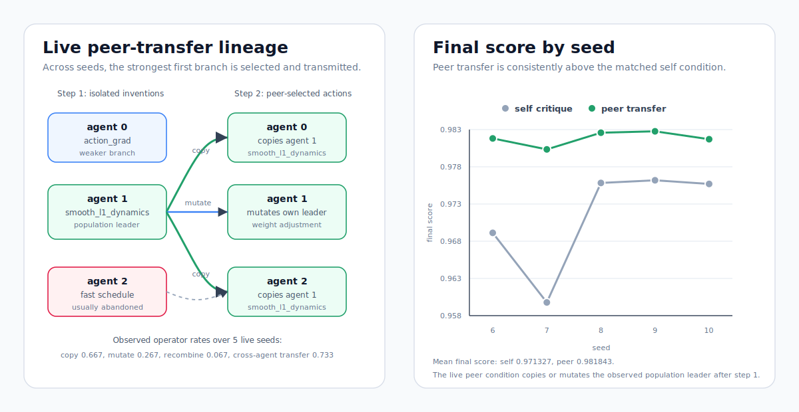
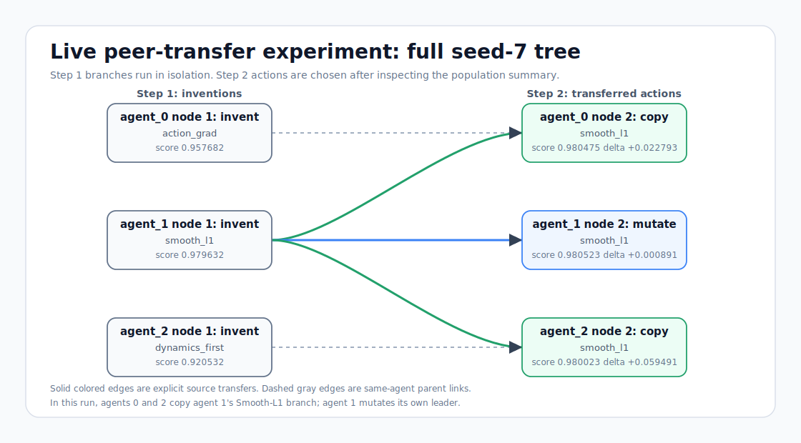
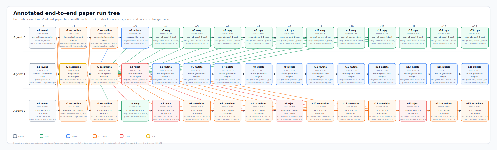

# Multiagent Codex Scientist

Multiagent Codex Scientist is an experimental harness for studying communication
between isolated AI research agents. The motivating question is:

> Under matched model, token, and experiment budgets, does communication between
> parallel Codex-Scientist workers improve TinyWorlds research decisions more
> than isolated self-critique?

The main experiments use `codex_scientist`, a supervised Codex-oriented runner
that gives each agent an isolated TinyWorlds workspace, bounded action surface,
branch summary, critique checkpoint, second action, and auditable metrics.

This repository is inspired by AI-Scientist-v2 style tree search, but the main
ablation harness is not a drop-in AI-Scientist-v2 implementation. The focus here
is narrower: communication, transfer, and lineage among parallel research
workers.



The left panel shows the communication checkpoint used by the ablation harness.
The right panel summarizes final-score lift from peer critique and live peer
transfer over their matched self-critique baselines.

## Concrete Communication Example

One communication event looks like this:

| Step | Agent | Content |
| --- | --- | --- |
| Proposal | A | Increase action supervision so the world model uses environment actions more reliably. |
| Critique | B | Stronger action supervision may over-regularize the model; track dynamics reconstruction separately from the aggregate score. |
| Revision | A | Keep the action-supervision change, but add/inspect the dynamics metric before treating the score gain as real. |
| Outcome | A | The follow-up distinguishes real dynamics improvement from a false positive caused by easier action-label fitting. |

This is the intended mechanism: a peer branch does not merely vote on whether an
idea is good; it points out a failure mode, which changes the next experiment or
the evidence required to accept the result.

## Main Results

Compact result tables are stored in [docs/results.md](docs/results.md). CSV
versions are in [results/](results/).
`Decision Changed` is the fraction of agents whose second action changed after
the communication checkpoint.

### Controlled Critique Ablation

Seeds: 0, 1, 2, 4, 5.

| Condition | Mean Final Score | Mean Improvement | Decision Changed | Cross-Agent Transfer |
| --- | ---: | ---: | ---: | ---: |
| self critique | 0.974884 +/- 0.001591 | 0.019771 +/- 0.001510 | 1.000000 +/- 0.000000 | 0.000000 +/- 0.000000 |
| peer critique | 0.981672 +/- 0.000351 | 0.025250 +/- 0.001448 | 1.000000 +/- 0.000000 | 0.666667 +/- 0.000000 |
| peer + roles | 0.981181 +/- 0.000912 | 0.024143 +/- 0.000852 | 1.000000 +/- 0.000000 | 0.666667 +/- 0.000000 |

Peer critique improved final score by +0.006788 absolute on average, about a
0.70% relative gain. Mean improvement increased by +0.005479, about a 27.7%
relative gain.

### Live Transfer Ablation

Seeds: 6, 7, 8, 9, 10.

In this setting, agents inspect first-step branch summaries and choose whether
the next node should copy, mutate, recombine, reject, or invent. The
self-critique condition can only invent or mutate its own branch.



| Condition | Mean Final Score | Mean Improvement | Decision Changed | Cross-Agent Transfer |
| --- | ---: | ---: | ---: | ---: |
| self critique | 0.971327 +/- 0.007087 | 0.013115 +/- 0.000647 | 1.000000 +/- 0.000000 | 0.000000 +/- 0.000000 |
| peer critique | 0.981843 +/- 0.000960 | 0.022194 +/- 0.004039 | 1.000000 +/- 0.000000 | 0.733334 +/- 0.149071 |

Live peer transfer improved final score by +0.010516 absolute on average, about
a 1.08% relative gain. Mean improvement increased by +0.009079, about a 69.2%
relative gain.

## Tree Visualizations

The live peer-transfer tree below shows a complete six-node experiment run. The
first step creates isolated inventions; the second step copies or mutates after
agents inspect the population summary.



The horizontal end-to-end paper-style tree below shows one of the longest recorded runs:
`runs/cultural_paper_tree_seed0`, with 45 nodes over 15 generations. Solid
colored edges are explicit copy, mutation, or recombination transfers; dashed
gray edges are same-agent parent links. Each node also notes the concrete
change made in that branch.



## Repository Layout

- `run_ablation.py`: main two-step communication ablation runner.
- `aggregate_results.py`: aggregates one run directory into CSV/JSON/Markdown.
- `commsci/`: implementation package.
- `commsci/codex_scientist/`: Codex-Scientist node actions, runner, workspace,
  communication, and paper helpers.
- `commsci/codex_scientistv2/`: paper-generation prototype. This is not used
  for the main communication ablations.
- `configs/controlled_critique.yaml`: documented config for controlled critique
  runs.
- `configs/live_transfer.yaml`: documented config for live transfer runs.
- `scripts/run_live_transfer_ablation.py`: reproduces the live transfer
  protocol with branch-summary checkpoint overrides.
- `scripts/summarize_paper_results.py`: regenerates `docs/results.md` and the
  compact CSVs in `results/`.
- `docs/`: paper-facing notes, final result summary, and agent instructions.
- `results/`: compact result CSVs intended to be tracked.
- `runs/`: generated run artifacts. This directory is intentionally ignored.

## Requirements

For local dry runs:

- Python 3.10 or newer
- `pyyaml`

For real TinyWorlds runs:

- a TinyWorlds or `tinyworlds-autoresearch` checkout
- dependencies required by that TinyWorlds checkout
- enough CPU/GPU runtime for the configured TinyWorlds budget

Minimal setup:

```bash
python3 -m venv .venv
source .venv/bin/activate
python3 -m pip install pyyaml
```

## Quick Start

Dry-run orchestration check:

```bash
python3 run_ablation.py \
  --config configs/v0_mac.yaml \
  --condition self_critique \
  --dry_run \
  --output_dir runs/test_self \
  --seed 0
```

Aggregate a run directory:

```bash
python3 aggregate_results.py --run_dir runs/test_self
```

Regenerate the paper-facing result summary from existing run artifacts:

```bash
python3 scripts/summarize_paper_results.py
```

## Reproducing The Main Experiments

### Controlled Critique

The controlled critique experiment compares:

- `self_critique`
- `peer_critique`
- `peer_critique_with_roles`

Each condition uses three agents and two experiment nodes per agent. Conditions
are matched on number of agents, experiment count, training budget, runtime
limit, critique template, token limits, temperature, and backend.

Example command shape:

```bash
for seed in 0 1 2 4 5; do
  for condition in self_critique peer_critique peer_critique_with_roles; do
    python3 run_ablation.py \
      --runner codex_scientist \
      --config configs/controlled_critique.yaml \
      --condition "$condition" \
      --num_agents 3 \
      --tinyworlds_dir /path/to/tinyworlds-autoresearch \
      --ai_scientist_data_dir /path/to/tinyworlds-autoresearch \
      --output_dir "runs/cultural_lineage_seed${seed}_${condition}" \
      --max_runtime_minutes_per_experiment 3 \
      --max_tokens_per_critique 1000 \
      --write_full_paper false \
      --seed "$seed"
  done
done
```

### Live Transfer

The live transfer experiment needs checkpoint override files after first-step
branch summaries are available. Use the dedicated runner:

```bash
python3 scripts/run_live_transfer_ablation.py \
  --seeds 6 7 8 9 10 \
  --tinyworlds_dir /path/to/tinyworlds-autoresearch
```

The script launches matched `self_critique` and `peer_critique` runs. At the
communication checkpoint, it reads each agent's `branch_summary.json`, writes
bounded critique/decision/action overrides, and resumes the second node.

## Action Surface

Codex-Scientist actions can use validated TinyWorlds knobs and one bounded
source patch recipe. Supported patch recipes are:

- `baseline_no_patch`
- `dynamics_first_schedule`
- `action_grad_dynamics`
- `smooth_l1_dynamics_pixel`
- `sharpen_change_weights`
- `full_budget_action_supervision`

For cultural-transfer runs, step-2 actions record an inheritance operator:

- `copy`
- `mutate`
- `recombine`
- `reject`
- `invent`

The coordinator applies patches only inside isolated per-node TinyWorlds
workspaces. It does not patch the original TinyWorlds checkout.

## Artifacts

Each standard agent writes:

- `branch_summary.json`
- `metrics_experiment_1.json`
- `critique.md` and `critique.json`
- `decision_change.json`
- `metrics_experiment_2.json`
- `research_note.md`
- `review.json`
- Codex-Scientist node metadata under `codex_scientist/nodes/{node_id}/`

`runs/` can become large because it contains copied workspaces, logs, diffs, and
per-node TinyWorlds outputs. Keep paper-facing summaries in `docs/` and
`results/`; treat `runs/` as generated evidence.

## Advanced Modes

The repository still contains experimental integrations beyond the main paper
results:

- `tinyworlds_command`: simple command-based train/eval runner.
- `ai_scientist_v2`: wrapper that can delegate branch expansion to an external
  AI-Scientist-v2 checkout.
- `codex_scientistv2`: paper-generation prototype with literature retrieval,
  controlled ablations, LaTeX generation, and local reviews.

These paths are useful for follow-up work, but they are not required to
understand or reproduce the two main communication ablations above.

## Related Docs

- [docs/results.md](docs/results.md): final compact result tables.
- [docs/codex_scientist_autoresearch.md](docs/codex_scientist_autoresearch.md):
  supervised Codex-Scientist agent instructions.
- [docs/code_recipe_experiment_writeup.md](docs/code_recipe_experiment_writeup.md):
  notes on source patch recipes and earlier experiment writeups.
- [docs/live_seed7_peer_tree.md](docs/live_seed7_peer_tree.md): example live
  peer-transfer tree.
- [docs/codex-aiscientistv2.md](docs/codex-aiscientistv2.md): paper-generation
  prototype brief.
