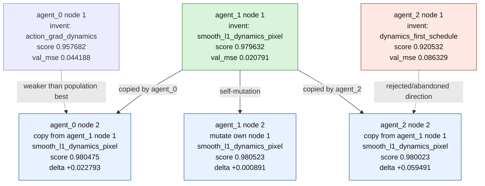

# Live Seed 7 Peer-Critique Tree

Run:

```text
runs/live_cultural_lineage_seed7_peer_critique
```

## Tree



## Interpretation

Agent 1's first branch was the population-best idea: use
`smooth_l1_dynamics_pixel` with `dynamics_pixel_loss_weight=6.0` and
`motion_prior_weight=1.5`.

At the communication checkpoint:

- Agent 0 copied agent 1's smooth-L1 idea and improved from `0.957682` to `0.980475`.
- Agent 1 mutated its own smooth-L1 idea and improved from `0.979632` to `0.980523`.
- Agent 2 abandoned its weak fast-schedule branch and copied agent 1, improving from `0.920532` to `0.980023`.

This is the clearest single-run tree for the cultural-evolution claim: a strong
idea appears in one branch, then spreads through copy and mutation to improve the
population.
